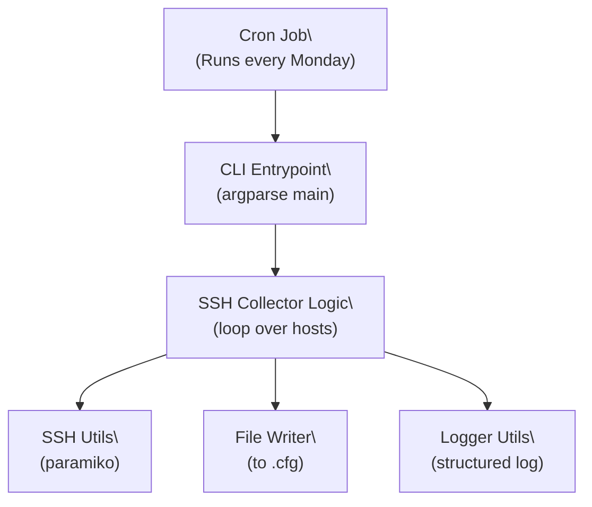

# Network Automation: SSH Config Collector

This tool connects to a list of network devices via SSH, retrieves their running configurations, and stores them in timestamped `.cfg` files for audit or backup purposes.

## Features

- SSH connection using `paramiko`
- Device list provided in YAML format (`devices.yaml`)
- Configs saved with timestamped `.cfg` filenames
- Structured logging (terminal + file)
- Configurable via `.env` and `settings.yaml`
- Modular and testable architecture
- Fully typed with Pydantic + Pytest coverage

---

## Usage

### 1. Prepare your environment

```bash
cp src/config/secrets.env .env
```

Set your `.env` file:

```env
SSH_USERNAME=your_user
SSH_PASSWORD=your_password
```

### 2. Install dependencies

```bash
make install
```

---

### 3. Run the tool

```bash
make run
```

Or directly:

```bash
python scripts/run_ssh_backup.py --devices-file=./config/devices.yaml
```

---

## File Output

Configs are saved as:

```text
configs/router1_20250518.cfg
configs/router2_20250518.cfg
```

---

## CRON Example

To run every Monday at midnight:

```cron
0 0 * * 1 /path/to/python /path/to/scripts/run_ssh_backup.py --devices-file /path/to/config/devices.yaml
```

---

## Tests

```bash
make test
```

Test coverage includes: CLI behavior, config loading, SSH logic (mocked), and file output.

---

## Lint & Format

```bash
make lint
```

Pre-commit hooks run: `black`, `isort`, `ruff`, and `mypy`.

---

## Project Structure

```
src/
├── cli/           # CLI interface
├── config/        # YAML + dotenv config
├── models/        # Device schema via Pydantic
├── services/      # Core orchestration logic
├── utils/         # SSH, logging, file, env helpers
scripts/           # CLI entrypoint wrapper
tests/             # Unit tests, mirrors src/
```

---

## Requirements

- Python 3.11+
- `paramiko`, `pydantic`, `python-dotenv`, `PyYAML`
- `pytest`, `pytest-mock`, `ruff`, `black`, `isort`, `mypy`

---

## Architecture



---

## Modules

| Layer    | Module                     | Responsibility                        |
|----------|----------------------------|----------------------------------------|
| CLI      | cli/main.py                | Parses arguments, calls collector     |
| Service  | services/ssh_collector.py  | Orchestrates host loop                |
| Utility  | utils/ssh_utils.py         | Runs SSH and fetches configs          |
| Utility  | utils/file_utils.py        | Writes config to disk                 |
| Utility  | utils/logger_utils.py      | Structured logging setup              |
| Config   | config/config.py           | Loads settings.yaml and .env          |
| Model    | models/device_model.py     | Device schema (hostname, IP, etc.)    |
